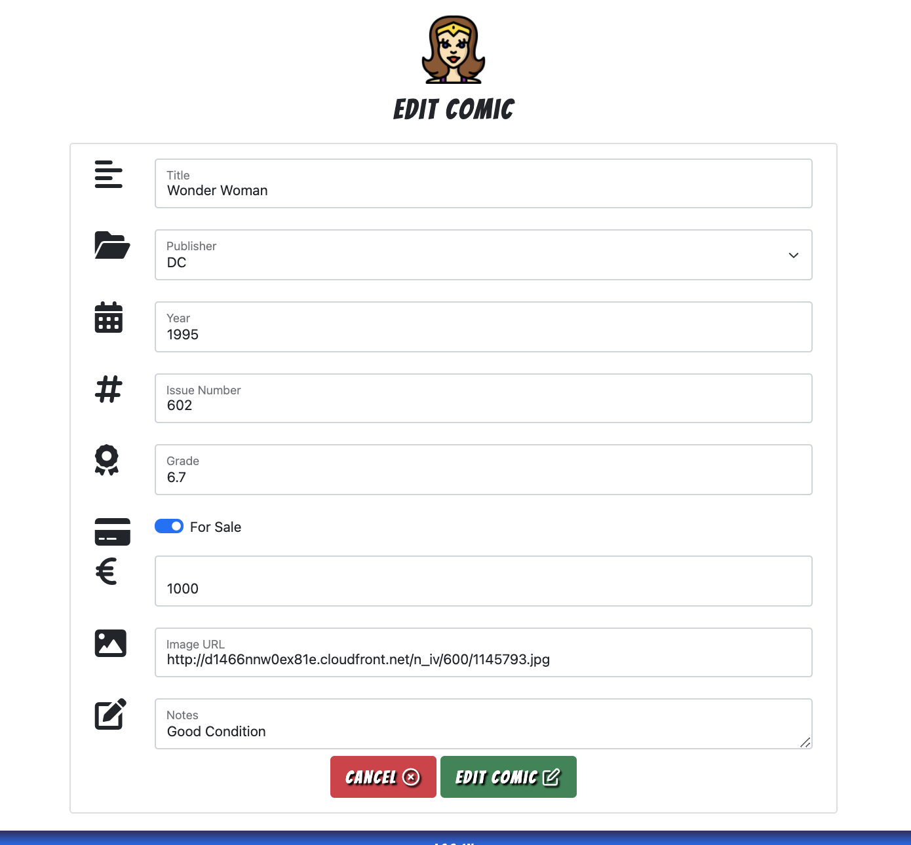

# **The Collector**

[View the live site here](https://the-collector-project.herokuapp.com/)

This website was built to fulfill the requirements of the Code Institute Milestone 3 Project. It has the goal of maintaining a database attached to a website, with full CRUD (Create, Read, Update and Delete) functionality. This is a full-stack site that allows users to catalogue and manage their comic book collections. There is an option for users to mark their comic books for sale. Other comic book collectors, whom are also members of the site, benefit from having access to this shared data due to the fact that they may search for comics and get in touch with each other in order to buy or sell their books.

The site owner's goals are met by being a user herself, having a place to catalogue all her comic books, possibly sell her own comic books, and being able to find other books from other collectors to add to her collection. A future goal for the site owner is to remove the ability for users to contact each other directly, but rather creating a system where users can buy and sell their comic books _within_ the site, and in return receiving a small commission for every book that is sold.


## **Contents**

[User Experience (UX)](#user-experience-ux)
* [User Stories](#user-stories)

[Design](#design)
* [Colour Scheme](#colour-scheme)
* [Typography](#typography)
* [Imagery](#imagery)
* [Wireframes](#wireframes)
* [Features](#features)
* [Future Features](#future-features)

[Information Architecture](#information-architecture)
* [Database Design](#database-design)
* [User Collection](#user-collection)
* [Comic Collection](#comic-collection)
* [Publishers Collection](#publishers-collection)

[Technologies Used](#technologies-used)
* [Languages Used](#languages-used)
* [Workspace](#workspace)
* [Version Control](#version-control)
* [Wireframing](#wireframing)
* [Responsive Design](#responsive-design)
* [Site Design](#site-design)
* [Database Design Technologies](#database-design-technologies)
* [Frameworks, Libraries and Others](#frameworks-libraries-and-others)
* [Testing](#testing)

[Deployment](#deployment)
* [Requirements for Deployment](#requirements-for-deployment)
* [Initial Deployment](#initial-deployment)
* [How to Fork it](#how-to-fork-it)
* [Making a Local Clone](#making-a-local-clone)

[Testing and Project Barrier Solutions](#testing-and-project-barrier-solutions)

[Credits](#credits)
* [Code](#code)
* [Content](#content)
* [Media](#media)
* [Acknowledgements](#acknowledgements)

---

## **User Experience (UX)**

### User Stories

#### First Time Visitor Goals

As a first time visitor to this site, a user should be able to:

* Easily navigate the site.
* Intuitively and easily understand what to do.
* Register for an account.
* Get visual feedback when an action on the site is completed.

#### Returning Visitor Goals

In addition to the First Time Visitor Goals, a Returning Visitor should be able to:

* Log in.
* Be confident that their password is be stored securely.
* Navigate intuitively, with no need to use the browser's back button.
* Update and delete their profile/account.
* Add comics to their catalogue.
* View their catalogue.
* Edit and delete comics.
* Browse and search other collector's comics.
* Log out.

#### Admin Goals

In addition to the First Time and Returning Visitor Goals, as an administrator of this site, an admin user should be able to:

* Be confident that a user can't force their way into the restricted pages.
* Edit or delete any user.
* Delete user's comics.
* Give or remove admin rights.

[Back to Top](#the-collector)

---

## **Design**

### Colour Scheme

* The website uses a colour theme most often used in superhero comic books for familiarity.

[Colour Palette - Coolers.co](https://coolors.co/a71313-3c3cdf-0f0f0f-ffffff-198754-ffca02)


### Typography

* The website uses a font from [Google Fonts](https://fonts.google.com/specimen/Bangers?query=bangers) called _Bangers_ for the logo, headings, and buttons. This font is often used in superhero Comic Books and was chosen for its familiarity. It has a fall back of _Cursive_. 
* _San-Serif_ was used everywhere else for its readibility.

### Imagery

* The icons in the site were taken from [font-awesome](https://fontawesome.com/) and used for their obvious meaning within the forms.
* The first image (on the home page) of the site was chosen as a background for the Title. It is a 'wall' of comic books. It gives the user an idea of what the site is about - comic book collections.
* The bursts that are seen on the home page are typical of what you might find inside comic books. 
* The avatars chosen are of popular superheros. By adding avatars, I wanted to give the user the feeling that their profile is personalized and fun.
* The default image when adding a comic book was chosen as everyone knows superman and it was the first superman comic book - A true collector's piece.

### Wireframes

[Here are the wireframes for desktop, mobile and tablet for this project](static/docs/wireframes.pdf).

After some careful consideration, I decided to change 'THE COLLECTORS' page to 'THE COLLECTION' page. I think that from a UX point of view, a user would prefer to browse and search through other comic books then to browse other collectors. So a complete list of all the comics that the collectors have added to their catalogues would display. Here, a user can browse and search for specific comics. Each comic will include the username of the specific Collector, and the user will then be able to view the catalogue of that Collector.

[See wireframes for the replacement section here](static/docs/wireframes_new_section.pdf).

### Features

* Register
    * 

---

* Log In


* Log Out

* Add a comic book to user's catalogue


* Edit a comic book from the user's own catalogue
* Edit a comic from 'The Collection' for admin users only


* Delete a comic book from the user's own catalogue.
* Delete a comic from 'The Collection' for admin users only


* Confirm comic deletion modal


* Update and Delete a profile/account


* Confirm account deletion modal


* Edit admin rights and edit or delete a user for admin users only.


* Auto-updating copyright year.


### Future Features

* Email verification before a user can add comic books.
* Enter user's password to delete user account.
* A toggle to allow the user to select whether they want to set their Catalogue as public or private.
* A system where The Collectors could sell comics to each other through the site so that the site owner could take a commission.
* Pagination

[Back to Top](#the-collector)

---

## **Information Architecture**

### Navigation bar

The navigation bar changes depending on user status and screen size:

| Nav Link | Logged Out | Logged In (User) | Logged In (Admin) |
|-------|-----|-----|-----|
| Logo (Profile page if logged in, Landing Page if not) | &#9989; | &#9989; | &#9989; |
| Log In | &#9989; | &#10060; | &#10060; |
| Register | &#9989; | &#10060; | &#10060; |
| Add Comics | &#10060; | &#9989; | &#9989; |
| My Catalogue | &#10060; | &#9989; | &#9989; |
| The Collection | &#10060; | &#9989; | &#9989; |
| Profile | &#10060; | &#9989; | &#9989; |
| Manage Users | &#10060; | &#10060; | &#9989; |
| Log Out | &#10060; | &#9989; | &#9989; |

### Database Design

MongoDB was used to store data for this site in a database. The data has been set out in two collections, which are described below:

### User Collection

| User |  Type  |  Relationship  |
|---|---|---|
| _id | ObjectId |    |
| full_name | string |    |
| username | string |    |
| password | string |    |
| email | string |    |
| avatar_no | int |    |
| show_contact_details | string |
| is_admin| boolean |    |
| my_catalogue | array | comics._id |

### Comic Collection

| Comics |  Type  |
|---|---|
| _id | ObjectId |
| title | string |
| publisher_name | string |
| year | string |
| issue_no | string |
| grade | string |
| for_sale | string |
| price | string |
| notes | string |
| image_url | string |
| the_collector | string |
| show_contact_details | string |
| contact | string |

### Publishers Collection

| Publishers |  Type  |
|---|---|
| _id | ObjectId |
| publisher_name | string |

[Back to Top](#the-collector)

---

## **Technologies Used**

### Languages Used

* [HTML5](https://developer.mozilla.org/en-US/docs/Web/Guide/HTML/HTML5)
* [CSS3](https://developer.mozilla.org/en-US/docs/Archive/CSS3#:~:text=CSS3%20is%20the%20latest%20evolution,flexible%20box%20or%20grid%20layouts.)
* [JavaScript](https://developer.mozilla.org/en-US/docs/Web/JavaScript)
* [Python](https://www.python.org/)

### Workspace

* [GitPod](https://gitpod.io/) was used as a virtual IDE workspace to build this site.

### Version Control

* [Git](https://git-scm.com/) was used for version control by utilizing the Gitpod terminal to add and commit to Git and push to GitHub.
* [GitHub](https://github.com/) is used to store the code for this project after being pushed from Git.

### Wireframing

* [Balsamiq](https://balsamiq.com/) was used to create the wireframes during the design process.

### Responsive Design

* [Am I Responsive Design]()

### Site Design

* [Font Awesome](https://fontawesome.com/) was used on all pages to add the icons.
* [Coolers.co](https://coolors.co/a71313-3c3cdf-0f0f0f-ffffff-198754-ffca02) was used to generate the colour palette in the readme.
* [Google Fonts](https://fonts.google.com/) was used to import the _Bangers_ font used within the site.
* [Favicon.io]()

### Database Design Technologies

* [MongoDB](https://www.mongodb.com/) was used to store the contents of the database, and allow full CRUD functionality.
* [Flask-PyMongo](https://flask-pymongo.readthedocs.io/en/latest/) was used to connect this Python / Flask app to MongoDB.

### Frameworks, Libraries and Others

* [Heroku](https://www.heroku.com) was used to deploy the live site.
* [Google DevTools]()
* [Lighthouse]
* [Flask](https://flask.palletsprojects.com/en/2.0.x/) was used to help create the templating for this site.
* [Bootstrap](https://getbootstrap.com/) was used to create a beautiful, responsive website.
* [jQuery](https://jquery.com/) was used to make the DOM traversal easier within the JavaScript.
* [Jinja](https://jinja.palletsprojects.com/en/3.0.x/) was used to auto-populate the site with the contents of the database.
* [RandomKeygen](https://randomkeygen.com/) was used to generate a strong `SECRET_KEY`.
* [Flask-paginate]()
* [pip](https://pip.pypa.io/en/stable/) was used to install the required dependancies for this site.
* [dnspython](https://pypi.org/project/dnspython/) was used to provide access to DNS.

### Testing

* [W3C Markup Validator]() was used to test that the HTML is valid.
* [W3C CSS Validator]() was used to test that the CSS is valid.
* [Markdownlint GitPod Extension](https://open-vsx.org/vscode/item?itemName=DavidAnson.vscode-markdownlint)
* [JSHint GitPod Extension](https://open-vsx.org/vscode/item?itemName=dbaeumer.jshint)
* [PyLint Extension](https://pypi.org/project/pylint/)

[Back to Top](#the-collector)

---

## **Deployment**

### Requirements for Deployment

* Python
* MongoDB account and database
* GitHub account
* Heroku account

### Initial Deployment

* MONGO_DBNAME - This is the name of the database you need to connect to in MongoDB.

* MONGO_URI - This can be found on the MongoDB website by following these steps:
    * In the clusters tab of your database, click connect on the associated cluster.
    * Click 'Connect', then 'Connect your application'.
    * Copy the string, then substitute the password (from Database access NOT your MongoDB password) and change "myFirstDB" to your MONGO_DBNAME.

* SECRET_KEY - This is a custom string set up to keep sessions secure. I recommend using a 'Fork Knox' level password generated by [RandomKeygen](https://randomkeygen.com/).

* This site was deployed to Heroku by following these steps:

    1. Heroku needs to be told what the requirements are for this project, so go into your GitPod terminal, and create files to explain the requirements by using the following commands:
        * `pip3 freeze --local > requirements.txt`
        * `echo web: python run.py > Procfile` - Ensure there is no blank line after the contents of this file
    2. Push these changes to your repository.
    3. Ensure you have a .gitignore file in your repository, and if not, create one.
    4. Add `env.py` and `__pycache__/` into your .gitignore file, and save the file. This is to avoid any sensitive information being added into your repository.
    5. Create an env.py file, and add the following information to it, updating the '## x ##' values with your own values:

        ``` python
        import os

        os.environ.setdefault("IP", "0.0.0.0")
        os.environ.setdefault("PORT", "5000")
        os.environ.setdefault("SECRET_KEY", " ## YOUR SECRET_KEY ## ")
        os.environ.setdefault("MONGO_URI", " ## YOUR MONGO_URI ## ")
        os.environ.setdefault("MONGO_DB", " ## YOUR MONGO_DBNAME ## ")
        ```

    6. Login or sign up to [Heroku](https://www.heroku.com).
    7. Select 'Create New App' in the top right of your dashboard.
    8. Choose a unique app name, and select the region closest to you, before clicking 'Create App'.
    9. Go to the 'Deploy' tab, find 'Deployment Method' and select 'GitHub'.
    10. Search to find your GitHub repository, and click 'Connect'. Don't enable automatic deployment yet, as this can cause errors.
    11. Go to the 'Settings' tab, find 'Config Vars', and click 'Reveal Config Vars'.
    12. Enter key value pairs that match those in your env.py file, displayed like this :

        | Key | Value |
        |---|---|
        | IP | 0.0.0.0 |
        | PORT | 5000 |
        | MONGO_DBNAME | ## YOUR DATABASE NAME ## |
        | MONGO_URI | ## YOUR MONGO_URI ## |
        | SECRET_KEY | ## YOUR SECRET_KEY ## |

    13. Go to the 'Deploy' tab, and click 'Enable Automatic Deployment'.
    14. In 'Manual Deploy', choose which branch you'd like to deploy from (I chose 'master' branch, this is also known as 'main').
    15. Click 'Deploy Branch' to deploy your app onto the Heroku servers.
    16. Once the app has finished building, click 'Open App' to open your site.

### How to Fork it

1. Login or Sign Up to [GitHub](www.github.com).
2. On GitHub, go to [CarlaBuongiorno/The-Collector](https://github.com/CarlaBuongiorno/The-Collector).
3. In the top right, click "Fork".
4. You will need to create an env.py file with your own values, and create a MongoDB database with the data keys and types as shown above.
5. You will also need to install all of the project requirements. This can be done using the command `pip3 install -r requirements.txt`.
6. Type `python3 app.py` in your GitPod terminal to run your local site of this project.

### Making a Local Clone

1. Log in to [GitHub](https://www.github.com) and locate the [Repository](https://github.com/CarlaBuongiorno/The-Collector) for this site.
2. Under the repository name, above the list of files, click "Code".
3. Here you can either Clone or Download the repository.
4. You should clone the repository using HTTPS, clicking on the icon to copy the link.
5. Open Git Bash.
6. Change the current working directory to the new location, where you want the cloned directory to be.
7. Type `git clone`, and then paste the URL that was copied in Step 4.
8. Press Enter, and your local clone will be created.
9. You will need to create an env.py file with your own values, and create a MongoDB database with the data keys and types as shown above.
10. You will also need to install all of the project requirements. This can be done using the command `pip3 install -r requirements.txt`.
11. Type `python3 app.py` in your GitPod terminal to run your local site of this project.

[Back to Top](#the-collector)

---

## **Testing And Project Barrier Solutions**

All testing and project barriers and solutions has been documented here - [testing.md](https://github.com/CarlaBuongiorno/The-Collector/blob/master/testing.md)

[Back to Top](#the-collector)

---

## **Credits**

### Code

* [Code Institute](https://codeinstitute.net/) was the main source of information used to create this project, specifically the Task Manager Mini Project Walkthrough.
* [Bootstrap](https://getbootstrap.com/): Throughout the site, to create a beautiful responsive site.
* [DEV](https://dev.to/domysee/keeping-the-footer-at-the-bottom-with-css-flexbox-5h5f) for keeping the footer at the bottom on all pages.

### Content

* 

### Media
* The default image when adding comics was taken from [Los Angeles Times](https://www.latimes.com/books/jacketcopy/la-et-jc-first-superman-comic-book-record-price-3-point-2-million-20140825-story.html).
* The home page wall of comic books background image was taken from [InspiredImages](https://pixabay.com/photos/marvel-comics-cartoon-entertainment-1641554/?download) on Pixabay.
* The blue comic burst was taken from [Star Vectors by Vecteezy](https://www.vecteezy.com/vector-art/2128471-pop-art-comic-book-background-with-bubble-speech).
* The yellow comic burst was taken from [Cartoon Vectors by Vecteezy](https://www.vecteezy.com/vector-art/240863-abstract-comic-background-design-vector).
* The avatars were taken from [flaticon.com](https://www.flaticon.com/)
    * [Spiderman](https://www.flaticon.com/premium-icon/spiderman_1090806?term=spiderman&page=1&position=2&page=1&position=2&related_id=1090806&origin=search)
    * [Deadpool](https://www.flaticon.com/premium-icon/superhero_1090740?related_id=1090740)
    * [Batman](https://www.flaticon.com/free-icon/superhero_892754?related_id=892754)
    * [Black Panther](https://www.flaticon.com/premium-icon/superhero_1090731?related_id=1090731)
    * [Iron Man](https://www.flaticon.com/free-icon/superhero_892721?related_id=892721)
    * [Cyclopes](https://www.flaticon.com/free-icon/superhero_1352466?term=super%20hero&related_id=1352466)
    * [Superhero](https://www.flaticon.com/free-icon/superhero_4080887?term=super%20hero&page=11&position=61&page=11&position=61&related_id=4080887&origin=search)
    * [Superhero](https://www.flaticon.com/free-icon/superhero_1352468?term=super%20hero&page=17&position=22&page=17&position=22&related_id=1352468&origin=search)
    * [Woman Superhero](https://www.flaticon.com/free-icon/superhero_2155000?term=woman%20super%20hero&related_id=2155000)

### Acknowledgements

* 

[Back to Top](#the-collector)