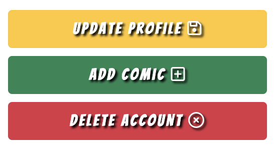
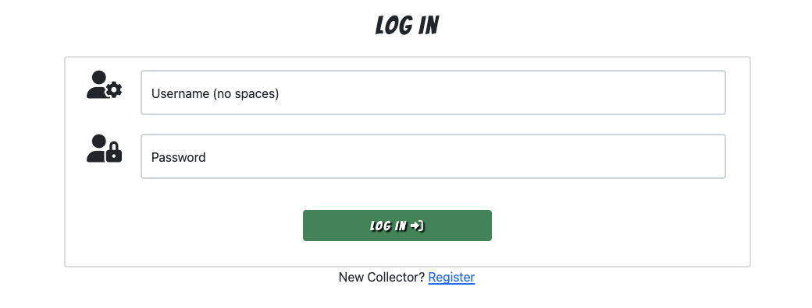
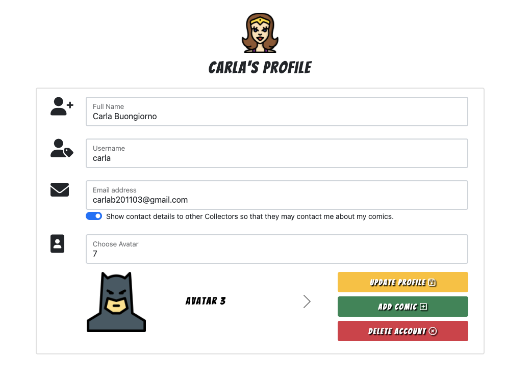
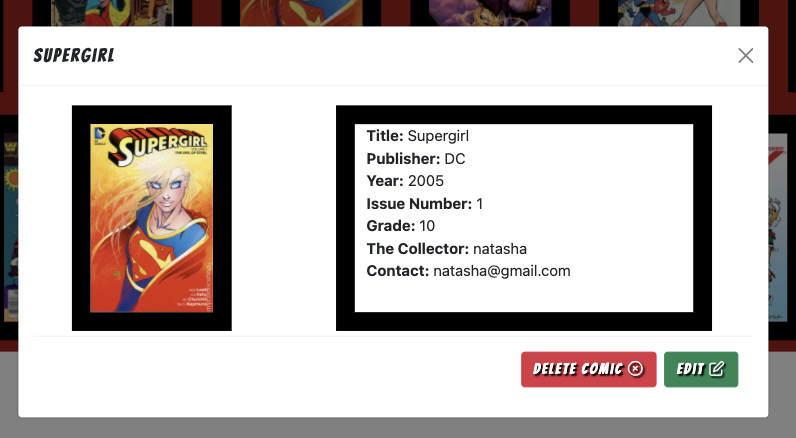

# **Testing And Project Barrier Solutions**

[Return to README.md](https://github.com/CarlaBuongiorno/The-Collector/blob/master/README.md)

[View the live site here](https://the-collector-project.herokuapp.com/)

## **Contents**

[Testing User Stories](#testing-user-stories)

[Code Validation](#code-validation)

[Responsiveness And Compatibility](#responsiveness-and-compatibility)

[Testing Performance](#testing-performance)
* [Lighthouse](#lighthouse)

[Project Barriers and Solutions](#project-barriers-and-solutions)
* [Solved Bugs](#solved-bugs)
* [Known Bugs](#known-bugs)

---

## **Testing User Stories**

### **First Time Visitor**
#### **Easily navigate the site.**

* Clicking on a menu item in the navigation bar displays the relevant page without errors.
* Clicking on a link in the footer displays the relevant page without errors.
* The navigation bar is easily visible on every page of the site.
* This displays differently depending on what access the user has.
* The navigation bar is easy to understand and always there for ease of navigation on the site.
* The logo at the top left of the page, as well as in the footer, takes the user back to the home page at any given point.
    * 
    * 
    * 
    * 
    * 

---

#### **Intuitively and easily understand what to do.**

* All buttons are clearly labelled.
* All links and buttons have descriptive text.
* Each page and each step taken by a user, leads a user through the site to the appropriate pages.
    * 

---

#### **Register for an account.**

* The Register button is visible for all users who aren't logged in.
* A user is able to register an acount by clicking the 'Register' link in the Menu or, by clicking the 'Register' button in the footer.
* A form will be presented to the user to complete, and a message is displayed to welcome the new user if everything was successful.
* The Register form is clear and easy to follow.
* There are validation messages if you don't enter the correct format of information.
    * 
    * 
    *     

---

#### **Get visual feedback when an action on the site is completed.**

* There are validation messages for all the forms if a user doesn't enter the correct format of information.
* Flash messages are presented to the user: 
    * when the user chooses a username already existing in the database.
        * 

    * when the user enters an incorrect username or password.
        * 

    * upon successful registration.
        * 

    * upon logging in.
        * 

    * upon logging out.
        * 

    * upon updating their profile.
        * 

    * upon deleting their account.
        * 

    * upon successfully adding a comic to their catalogue.
        * 

    * upon editing a comic.
        * 

    * upon deleting a comic.
        * 

---

### **Returning Visitor**
#### **Log in**

* The Log In button is visible for all users who aren't logged in.
* The Log In button is positioned on the navbar and the footer.
* The form is clear and easy to follow.
    * 
    * 
    * 
    * 

---

#### **Be confident that their password is being stored securely.**

* Werkzeug's password hashing methods have been used to store all user's passwords in a secure and safe way.

---

#### **Navigate intuitively, with no need to use the browser's back button.**

* The navigation bar is constantly visible across the top of the site.
* This is either the full navigation bar or, the condensed burger icon menu bar on smaller screen sizes.
* The logo at the top left of the navigation bar, as well as on the footer, always brings the user back to the home page.
    * 
    * 
    * 
    * 
    * 
    * 

---

#### **Update and delete their profile/account.**

* Upon registration, or logging in, a user is immediately taken to their 'Profile' page.
* Here, the user has the option of either updating their profile or, deleting their account all together.
* Clicking on the 'Delete Account' button will bring up a second modal checking if the user is certain they wish to delete their account.
    * 
    * 

---

#### **Add comics to their catalogue.**

* The user can add comic books through, a button on their profile page, a link on the navbar, as well as a button on their catalogue page.
* The 'Add Comic' form is clear and easy to follow. 
* There are validation messages if you don't enter the correct format of information or skip required fields.
    * 
    * 
    * 
    * 

---

#### **View their catalogue.**

* Once a comic has been successfully added, it appears on the user's 'Catalogue' page.
* Clicking on a comic in the user's catalogue brings up a modal displaying all the information the user entered about that comic.
    * 
    
---

#### **Edit and delete comics.**

* The comic books' modals have the option to edit and delete the specific comic.
* Clicking on the 'Delete' button will bring up a second modal checking if the user is certain they wish to delete that comic.
* Clicking on the 'Edit' button will take the user to the form they used to add the comic with all the information prefilled. There they can adjust the information about the comic and save it by clicking the 'Edit Comic' button.
    * 
    * 
    * 

---

#### **Browse and search other collector's comics.**

* On the 'Collection' page, users are able to browse through all the comics that have been added by other collectors. 
* Clicking on a comic brings up a modal displaying relevant information about that comic, including the username of that Collector.
* On the 'Collection' page, users also have the option to search through 'The Collection'. 
* Users can search by 'Title', 'Publisher Name', 'Issue Number', by the words used within the collectors 'Notes', and by the actual 'Collector' him/herself.
    * 
    * 
    * 
    
---

#### **Log out.**

* The 'Log Out' button is visible for all users who are logged in.
* The Log Out button is positioned on the navbar and the footer.
    * 
    * 
---

### **Admin**
#### **Be confident that a user can't force their way into the restricted pages.**

* Admin users are set with an is_admin: 'True' in the database.
    * 

---

#### **Delete user's comics.**

* If the user has the is_admin toggle set to true, then they will have access to edit or delete any comic book from the Collection.
    * 

[Back to Top](#testing-and-project-barrier-solutions)

---

## **Code Validation**

### W3C Markup Validation Service:

Each page of the site was run through the [W3C Markup Validation Service](https://validator.w3.org/) by direct input and returned no errors. As the webpages are dynamically rendered with Jinja template, each scenario had to be validated by direct input by viewing and copying the source code for the page.

The HTML validation screenshots for each page can be found in the folder: _docs/html_validation_.

### W3C CSS Validation Service:

The CSS file was tested with [W3C CSS Validation Service](http://jigsaw.w3.org/css-validator/) via direct input and returned no error.

The warning is due to that the imported style sheets are not checked in direct input and file upload modes by W3C validation services.

The CSS validation screenshot can be found in the folder _docs/html_validation_.

### JSHint:

All javascripts files were tested with [JSHint](https://jshint.com/) and returned no errors. 

### Python 8:

The python file was run through [PEP8](http://pep8online.com/) online and returned no errors.

[Back to Top](#testing-and-project-barrier-solutions)

---

## **Responsiveness And Compatibility**

The website was tested through the following browsers:

* Google Chrome
* Microsoft Edge
* Mozilla Firefox
* Safari

All working as expected.

DevTools were used to test the site across a range of widths:

* Mobiles: 
    * iphone5(320px)
    * Samsung S5 (360px)
    * iPhone 6/7/8/X (375px)
    * iPhone 6/7/8 Plus (414px)

* Tablets:
    * iPad (768px)
    * iPad Pro (1024px)

* Desktops:
    * Laptop (1200px)
    * Large Desktop screen (1920px)

All working as expected.

The site was tested on the following physical devices:

* Mobiles: 
    * small phone (320px)
    * large phone (414px)
* Tablets:
    * large tablet (768px)
* Desktops:
    * Medium laptop (1366px)
    * Large Desktop screen (1920px)

All working as expected.

[Back to Top](#testing-and-project-barrier-solutions)

---

## **Testing Performance**

### Lighthouse
Google Lighthouse was run on different pages returning different results. Below is an extract of the reports for the 'Home' page, 'My Catalogue' page and 'Add Comic' page:

 * Home
    * 

* My Catalogue
    * 

* Add Comic
    * 

[Back to Top](#testing-and-project-barrier-solutions)

---

## **Project Barriers and Solutions**

### Solved Bugs

1. It was possible to register a duplicate username regardless of the code written to check if the username already exists in the database. The flash message that tells the user that the username already exists did not display, and instead the registration was successful.
    * Fixed the 'for' of the username label to 'username' instead of 'name'.
    * The collection I used to check 'existing_user' was 'users' with an 's' at the end, while the one I tried to insert was 'user' without the 's'. Correcting this solved the bug.
2. The Bootstrap toggle switch for the 'For Sale' field, remains 'checked' upon inspection, despite being toggled 'off'.
    * This could be Bootstrap applying javascript behind the scenes.
    * Upon more investigation, this was remedied by adding and event listener to listen for a change in the toggle switch and if the field is 'checked', then set or remove the required attribute to the 'price' field.
3. Deleting a comic would remove it from the 'comics' collection, but the ObjectId would remain in the 'user' collection where it is stored in the 'my_catalogue' field in an array.
    * Originally, the comic was only being deleted from the 'comics' collection.
    * To fix this, I needed to grab the user from the session, get the user from the database using the user from the session, get the user's ID and use the '$pull' command, with the ID of the comic, and then remove it from the user's 'my_catalogue'.
4. The 'Notes' field within the 'Edit Comic' form, would render empty instead of what the user previously had filled.
    * This was due to the 'id', 'name', and 'for' attributes not being consistent with each other. 
5. Admin could delete another user's comic, but the user's 'my_catalogue' array of comic IDs would not be updated.
    * The first issue was that the function was first deleting the comic, then in the 'if user is admin', trying to find the 'the_collector' from a comic id that no longer existed.
    * Moving the delete functionality to after the 'IF' block brought me a step closer to fixing this bug.
    * The second issue was that I was trying to find the user's collection, in order to update their catalogue, by their 'ID' (which I did not have). By substituting this for what I did have ('username'), the issue was resolved.

### Known Bugs

* There are no known errors.

[Back to Top](#testing-and-project-barrier-solutions)
